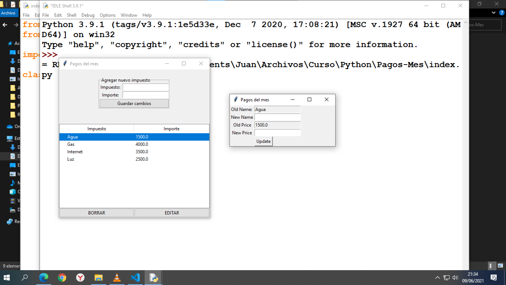

<!-- HEADINGS -->

# Cuadros y tablas
## Requisitos:
* Python 3.9
* Github
* Visual Studio Code
* DB Browser for Sqlite
### El trabajo que estoy realizando consiste en fabricar cuadros en Python (.py)

### A estos cuadros estoy intentando insertarles tablas creadas con DB Browser Sqlite (.db)

### Como puede verse, las tablas son simples. Con filas y columnas que contienen diferentes tipos de variables. En este caso, estoy probando cuadros organizativos de pagos de impuestos del mes y sus respectivos importes. De no más de dos columnas, en principio. Para ello, estoy siguiendo un tutorial, dentro del cual, la línea 57 indica el comando con el que la tabla debería insertarse en el cuadro

### Y este es el resultado final
